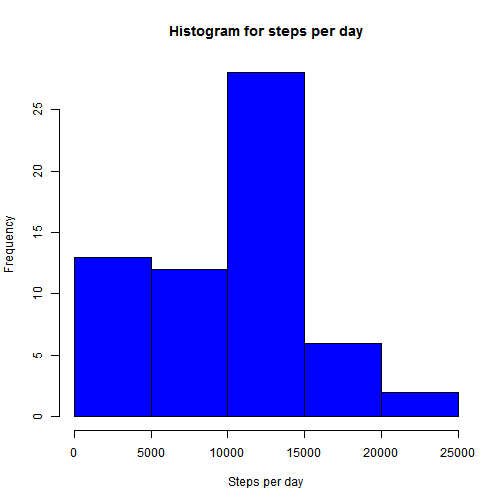
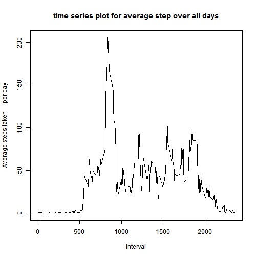
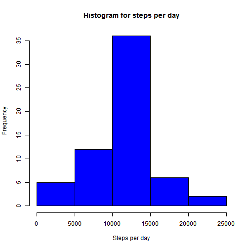
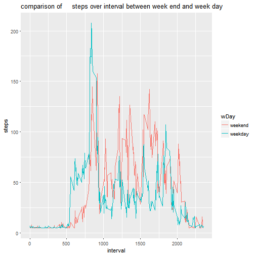

Assignment1 for Reproducible Research
---------------------------------------
[downloaded and extracted zip file to local folder using below link](https://d396qusza40orc.cloudfront.net/repdata%2Fdata%2Factivity.zip) 


1.Rscript for loading data from local folder 
    
    
    ```r
    library(knitr)
    setwd('D:/Data science/Reproduciable research/repdata_data_activity')
    quiz<-read.csv('activity.csv',header=T)
    ```
2. Aggregating steps for each day and producing histogram for steps per day
    
    ```r
    quiz$date_cons=as.Date(as.character(quiz$date),'%Y-%m-%d')
    
    hist_steps=tapply(quiz$steps,quiz$date_cons,sum,na.rm=T)
    hist(hist_steps,xlab='Steps per day',main='Histogram for steps per day',col='blue')
    ```
    
    

3. report for mean and median of steps per day
    
    ```r
    report=cbind(mean(hist_steps),median((hist_steps)))
    colnames(report)=c('mean of total number of step per day',' median of total number of step per      day')
    
    print(report,type='html')
    ```
    
    ```
    ##      mean of total number of step per day
    ## [1,]                              9354.23
    ##       median of total number of step per      day
    ## [1,]                                        10395
    ```
4. claculate average steps across al the days for each interval and producing time series plot
    
    ```r
    time_series_steps=aggregate(steps~interval,quiz,mean,na.rm=T)
    with(time_series_steps,plot(interval,steps,type='l',xlab='interval',ylab='Average steps taken     per day',main='time series plot for average step over all days'))
    ```
    
    

5.The 5-minute interval that, on average, contains the maximum number of steps 

    
    ```r
    interval_max=time_series_steps[time_series_steps$steps==max(time_series_steps$steps),]
    x=interval_max$interval[1]
    ```
The 5-minute interval that, on average, contains the maximum number of steps is ``835``


6.Code to describe and show a strategy for imputing missing data

 -calculte number and percentage of missing values

    
    ```r
    sum(is.na(quiz$steps))
    ```
    
    ```
    ## [1] 2304
    ```
    
    ```r
    mean(is.na(quiz$steps))
    ```
    
    ```
    ## [1] 0.1311475
    ```
    
 -filling missing values with mean of steps and created new data set
    
    ```r
    quiz2=quiz
    quiz2[is.na(quiz2$steps),'steps']=mean(quiz2$steps,na.rm=T)
    ```
7. Aggregating steps for each day and producing histogram for steps per day after imputation
    
    ```r
    hist_steps=tapply(quiz2$steps,quiz2$date_cons,sum,na.rm=T)
    hist(hist_steps,xlab='Steps per day',main='Histogram for steps per day',col='blue')
    ```
    
    

- report for mean and median of steps per day
    
    ```r
    report=cbind(mean(hist_steps),median((hist_steps)))
    colnames(report)=c('mean of total number of step per day',' median of total number of step per     day')
    
    print(report,type='html')
    ```
    
    ```
    ##      mean of total number of step per day
    ## [1,]                             10766.19
    ##       median of total number of step per     day
    ## [1,]                                    10766.19
    ```

mean and median, distribution of the steps are changed.
there is no skewness after imption of values.

8. 
create a vector identfing whethe day is week end or week day
calculate average number of steps per interval by week day and week end
producing plot average number of steps per interval for comparison between week end week day
    
    ```r
    weekdays1 <- c('Monday', 'Tuesday', 'Wednesday', 'Thursday', 'Friday')
    #Use `%in%` and `weekdays` to create a logical vector
    #convert to `factor` and specify the `levels/labels`
    quiz2$wDay <- factor((weekdays(quiz2$date_cons) %in% weekdays1), 
                         levels=c(FALSE, TRUE), labels=c('weekend', 'weekday'))
    time_series_steps=aggregate(steps~interval+wDay,quiz2,mean,na.rm=T)
    library(ggplot2)
    g=ggplot(time_series_steps,aes(interval,steps,colour=wDay))+geom_line()+ggtitle("comparison of     steps over interval between week end and week day")
    g
    ```
    
    
    
    
    
before 1000 minutes interval, week day has higer number of steps after 1000 minutes 
interval week end has higher number of steps
